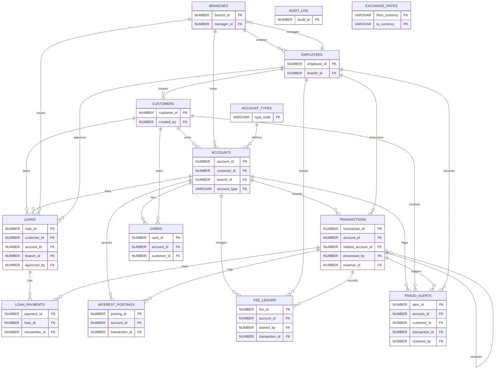

<h1>PLSQL Example Banking</h1>

This repository is an AI-generated sample PL/SQL banking application for demo and learning purposes.
It models core banking operations such as customer/account management, transactions, loans, reporting,
and database-level unit tests on Oracle.

<h2>What Is Included</h2>

<ul>
    <li><b>Schema and seed data</b> for a realistic banking domain</li>
    <li><b>PL/SQL packages</b> for account, transaction, loan, and reporting flows</li>
    <li><b>Unit test scripts</b> to validate core package behavior</li>
</ul>

<h2>Script Order</h2>

<ol>
    <li>01_DDL_SCHEMA.sql</li>
    <li>02_PKG_ACCOUNT_MGMT.sql</li>
    <li>03_PKG_TRANSACTIONS.sql</li>
    <li>04_PKG_LOAN_MGMT.sql</li>
    <li>05_PKG_REPORTING.sql</li>
    <li>06_UNIT_TESTS.sql</li>
</ol>

<h2>Purpose</h2>

The project is intended as a reference implementation for AI-assisted code generation and
PL/SQL-to-other-language modernization experiments, not as a production-ready banking system.

<h2>ER Diagram</h2>

